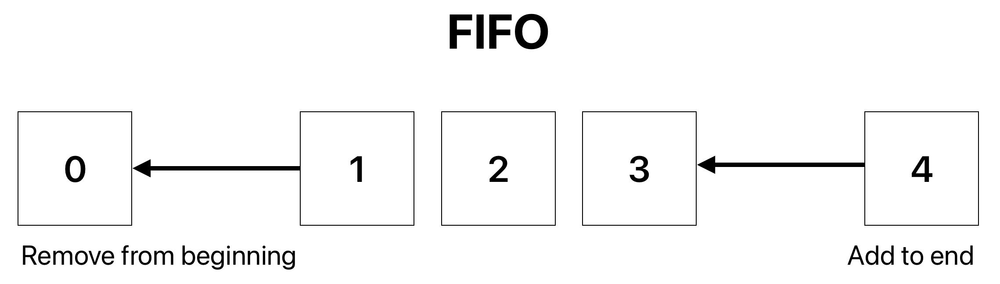

# Overview
Queues are a simple data structure that are defined by the order in which elements are added to and removed from the structure. They are similar to stacks in this sense. In a queue, elements are added to the end of the and removed from the beginning. This is known as a `FIFO` structure, or `First In First Out`, as illustrated below:

In Python, these are technically just lists but through a custom class implementation we are able to enforce this FIFO structure.

## Conceptual Example - Call Center
When you're on hold and hear the classic line "your call will be answered in the order it was received," this indicates that your call was added to a queue on the call center's servers. This is one of the most prevalent and well-known examples of a queue in our day to day lives.

# Implementation
Python does not natively support queues. However, it is not difficult to create a custom queue implementation using classes. Since a queue is defined by its FIFO structure, all you need to add is custom functionality to add and remove from the list.

> [!NOTE]
> Values will be stored in a list, so other features such as getting the length of the queue and finding a value at a given position will be the same syntax as a list.

## Add to queue
## Remove from queue

# Performance

# Examples
## Code samples - call center queue

# Common Pitfalls
## Syntax errors (very error-resistant structure)

# Sample Problem
## Restaurant order queue