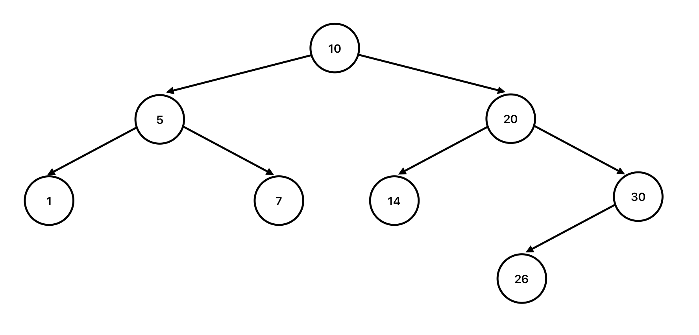

# Overview
Trees (more descriptively Binary Search Trees, or BSTs for short) are a collection of nodes that are connected to each other by whether a child node is greater or less than the parent node. A node can only have two children total, creating a fork at any given node of a value less than or greater than the current one. This is then repeated for each child, forming a tree of these forks. An example would look like this:



This is not a native structure in Python, and as such requires a custom implementation or third party library.

## Conceptual Example - Forks in the Road
Imagine you wanted to find the number 20 in a list of 500,000,000 elements. Going through each element individually to see if it equals 20 would be inefficient and would take a long time. Trees present a more efficient way to find this value.

Instead of looping through each value, imagine that we started looking at a fork in the road with a sign in the middle. The sign reads 100,000 and the left fork represents values less than this, and the right fork represents values more than this. Since 20 is less than 100,000, we go to the left. There's once again a fork in the road, and the sign reads 60,000. 20 is still less, so we go left again. This continues until we see a sign that reads 14. 20 is greater, so we go to the right. This time there is no fork - there is simply a sign reading 21. This is greater than our value, so we know that 20 is not in this tree.

This is a SIGNIFICANTLY faster approach to storing relative values, as it cuts the efficiency for most operations down to O(log n). There is extra nuance to keeping the tree balanced to maintain this efficiency, but in scenarios like this it is well worth the extra lift to reap these efficiency benefits.

# Implementation
As mentioned in the overview, trees are not a native structure to the Python language. To create them, you have to utilize a class to represent the tree and another class to represent the nodes. The tree class contains all the common operations such as adding and removing nodes, whereas the nodes simply contain information on their connected parent and children nodes. The tree only needs to know what the root node is, as that node and every other will link to its related nodes. A stubbed structure would look like the following:

```
class Tree {
    '''Contains methods for operations as well as the root node'''
    def __init__(self):
        '''Initialize as an empty tree'''
        self.root = None

    class Node {
        '''Contains only information, properties are adjusted by Tree'''
        def __init__(self, val):
            '''Initialize node with just its value'''
            self.val = val
            self.left_node = None
            self.right_node = None
    }

    def add(self, val):
        '''Add a value'''

    def get_height(self):
        '''Get the height of the tree'''

    def contains(self, val):
        '''Determine if value in tree'''
}
```

> [!IMPORTANT]
> Note that we do not cover removing from a Tree in this tutorial, as this requires a much larger lift than these operations.

## Add to tree
The easy side of adding to a tree is creating a new node and setting its parent, left_child, and right_child properties are set correctly. The difficult side is determining where in the tree the new value belongs. We'll start with the difficult part - the cleanest way to approach this is through recusrion.

```
def add(self, val):
    '''Add a child node'''
    if self.root is None:
        self.root = Tree.Node(val)
    else:
        self._add(data, self.root)

def _add(self, val, node):
    '''Recursively find appropriate place to add the value'''
    if val < node.val:
        if node.left_node is None:
            # Val belongs to the left of the node, and no node is there now
            # so we create a new one and set the current node's left value to
            # be the new node.
            node.left_node = Tree.Node(val)
        else:
            # Continue the recursion to the left
            self._add(val, node.left_node)
    elif val > node.val:
        if node.right_node is None:
            # Val belongs to the right of the node, and no node is there now
            # so we create a new one and set the current node's right value to
            # be the new node.
            node.right_node = Tree.Node(val)
        else:
            # Continue the recursion to the right
            self._add(val, node.right_node)
    else:
        # Handle duplicate val, in this case we'll reject it.
        # You could choose to add it to the left or right instead,
        # so long as you are consistent it doesn't matter.
        print("Duplicate values are not allowed!")
```

You'll note that the easy part is handled in one line within the `Tree.Node` call.

## If value in tree
Finding a value in a Tree is best done through recursion. It is a straightforward solution like so:
```
def contains(self, val):
    '''Determine if a value is in the tree'''
    return self._contains(val, self.root)

def _contains(self, val, node)
    '''Recusrively determine if value is in tree'''
    if val == node.val:
        # Value was found
        return True
    if val < node.val:
        if node.left_node is None:
            # Value is less than current value, but no node is to the left
            # so we can conclude it is not in the tree
            return False
        else:
            # Continue the recursion to the left
            self._contains(val, node.left_node)
    elif val > node.val:
        if node.right_node is None:
            # Value is larger than current value, but no node is to the right
            # so we can conclude it is not in the tree
            return False
        else:
            # Continue the recursion to the right
            self._contains(val, node.right_node)
```

## Calculate the height of tree
This is another recursive solution, which is really straightforward. This is what it will look like:
```
def get_height(self):
    '''Get the height of the tree'''
    if self.root is None:
        return 0
    else:
        # Will return the sum of the max branch that was found
        return self._get_height(self.root)

def _get_height(self, node):
    '''Recursively calculate the height'''
    if node is not None:
        # We haven't reached the end of a branch so keep going
        return 1 + max(self._get_height(node.left_node), self._get_height(node.right_node))
    else:
        # Bottom was reached, end the recursive branch
        return 0
```

# Performance
**Adding - O(log n)**
Since the forked structure lets us ignore large portions of the tree, the efficiency is O(log n).

**Finding Value - O(log n)**
Since the forked structure lets us only follow one path of the tree and ignore the other valeus, the efficiency is O(log n).

**Height - O(n)**
Since the recusive solution does follow every branch of the tree, the efficiency is O(n).

# Common Pitfalls
Again, the main pitfall to a tree is ensuring that it is balanced. If a tree becomes unbalanced (meaning that either the left or right side of the tree ends up having significantly more nodes than the other), it loses its efficiency. There are specific tactics to keep a tree balanced such as AVL, but this is outside the scope of this tutorial.

# Sample Problem
Recreate the tree shown in the overview section using the sample code provided throughout the tutorial. Print out the height of the tree after you've added all necessary values, and whether the tree contains the values 20 and 70. Check your solution with the one below when you are finished.

> [!TIP]
> Be sure to add the values in an order that will keep the tree balanced! Start with the root and work down each level from there.

This should be your answer:
```
class Tree {
    '''Contains methods for operations as well as the root node'''
    def __init__(self):
        '''Initialize as an empty tree'''
        self.root = None

    class Node {
        '''Contains only information, properties are adjusted by Tree'''
        def __init__(self, val):
            '''Initialize node with just its value'''
            self.val = val
            self.left_node = None
            self.right_node = None
    }

    def add(self, val):
        '''Add a child node'''
        if self.root is None:
            self.root = Tree.Node(val)
        else:
            self._add(data, self.root)

    def _add(self, val, node):
        '''Recursively find appropriate place to add the value'''
        if val < node.val:
            if node.left_node is None:
                # Val belongs to the left of the node, and no node is there now
                # so we create a new one and set the current node's left value to
                # be the new node.
                node.left_node = Tree.Node(val)
            else:
                # Continue the recursion to the left
                self._add(val, node.left_node)
        elif val > node.val:
            if node.right_node is None:
                # Val belongs to the right of the node, and no node is there now
                # so we create a new one and set the current node's right value to
                # be the new node.
                node.right_node = Tree.Node(val)
            else:
                # Continue the recursion to the right
                self._add(val, node.right_node)
        else:
            # Handle duplicate val, in this case we'll reject it.
            # You could choose to add it to the left or right instead,
            # so long as you are consistent it doesn't matter.
            print("Duplicate values are not allowed!")

    def get_height(self):
        '''Get the height of the tree'''
        if self.root is None:
            return 0
        else:
            # Will return the sum of the max branch that was found
            return self._get_height(self.root)

    def _get_height(self, node):
        '''Recursively calculate the height'''
        if node is not None:
            # We haven't reached the end of a branch so keep going
            return 1 + max(self._get_height(node.left_node), self._get_height(node.right_node))
        else:
            # Bottom was reached, end the recursive branch
            return 0

    def contains(self, val):
        '''Determine if a value is in the tree'''
        return self._contains(val, self.root)

    def _contains(self, val, node)
        '''Recusrively determine if value is in tree'''
        if val == node.val:
            # Value was found
            return True
        if val < node.val:
            if node.left_node is None:
                # Value is less than current value, but no node is to the left
                # so we can conclude it is not in the tree
                return False
            else:
                # Continue the recursion to the left
                self._contains(val, node.left_node)
        elif val > node.val:
            if node.right_node is None:
                # Value is larger than current value, but no node is to the right
                # so we can conclude it is not in the tree
                return False
            else:
                # Continue the recursion to the right
                self._contains(val, node.right_node)
}

tree = new Tree()
tree.add(10)
tree.add(5)
tree.add(20)
tree.add(1)
tree.add(7)
tree.add(14)
tree.add(30)
tree.add(26)

print(tree.get_height()) # 3
print(tree.contains(20)) # True
print(tree.contains(70)) # False
```